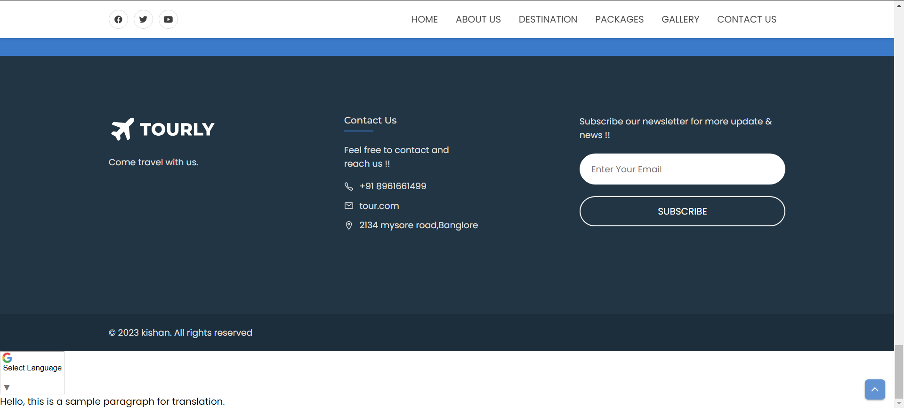
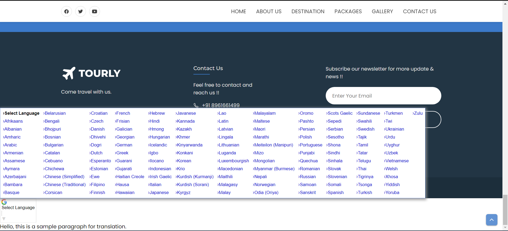
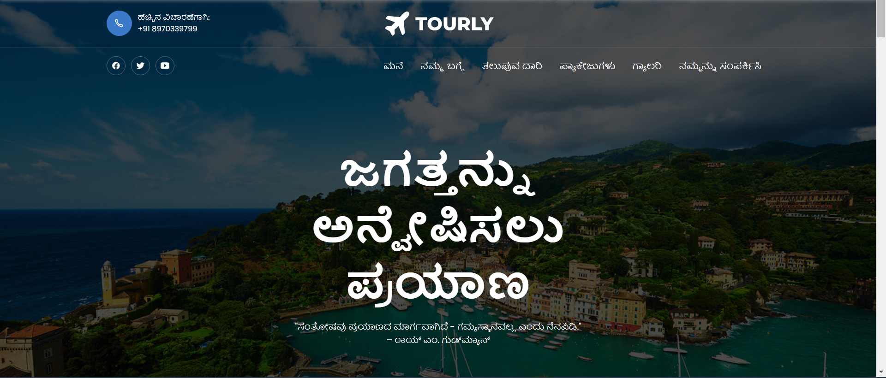
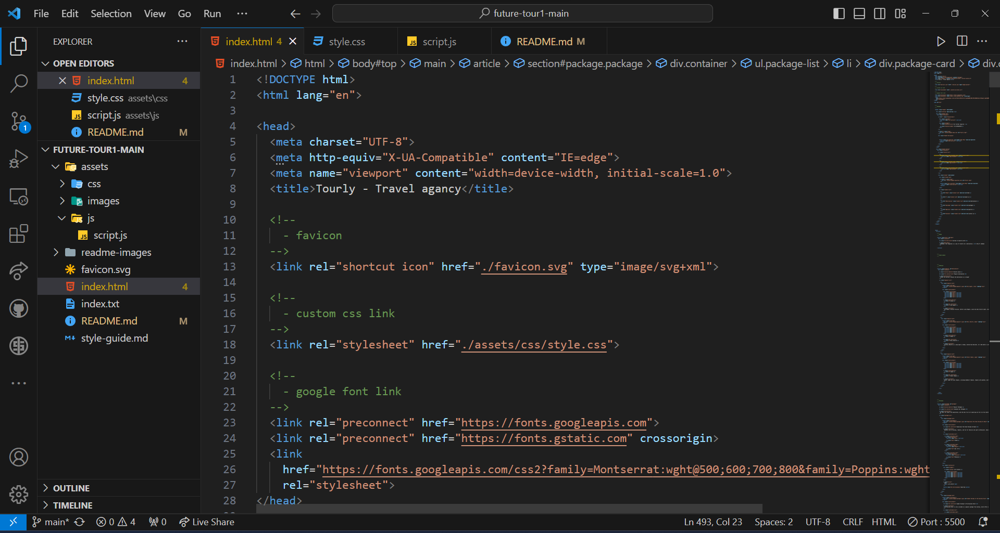
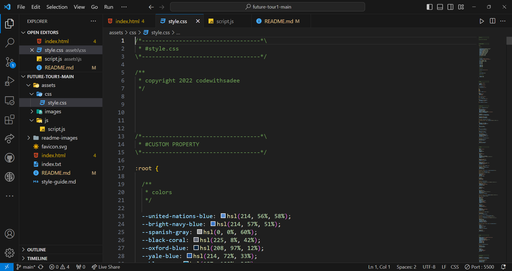
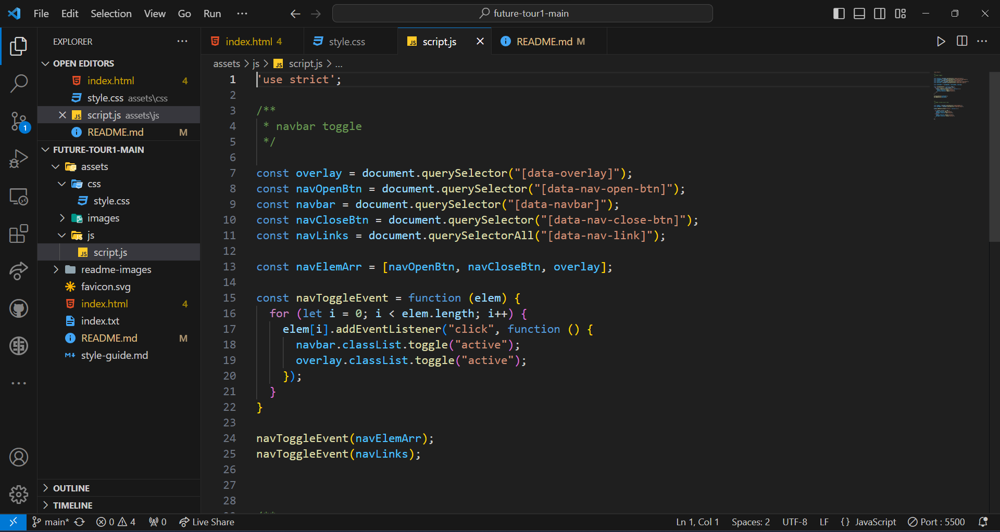

<<<<<<< HEAD
<div align="center">
 
  <br />
  <br />
  
  

  <h2 align="center">Tourly - Travel website</h2>

  Welcome to TOURLY – Your Window to the World!

Explore the beauty of our planet through our curated collection of stunning images and captivating stories. Our static webpage is designed to showcase the allure of various destinations, giving you a sneak peek into the wonders that await.
<h1>Built With  </h1>
This website is build using the following Technologies: -

HTML

CSS

JavaScript

  <a href="https://kishan-spec.github.io/future-tour1/"><strong>➥ Live Demo</strong></a>

</div>

<br />

### Demo Screeshots
this is our main page where user can navigate to any section of the web page.

<br />

<br />

Towards the bottom of the page, you'll find a language selection feature that allows you to translate our webpage into your preferred language. Explore the content in a language that suits you best and enhances your browsing experience.
<br />

<br />

<br />
here is the kannada version of the web page


<br />
here is the jananese version of the web page


<br />


### Microsoft Visual Studio Code
Used Microsoft Visual Studio Code to develop the application website using HTML, CSS and JavaScript.

<br />

<br />

<br />

### Prerequisites

Before you begin, ensure you have met the following requirements:

* [Git](https://git-scm.com/downloads "Download Git") must be installed on your operating system.

### Run Locally

To run **Tourly** locally, run this command on your git bash:

Linux and macOS:

```bash
sudo git clone https://kishan-spec.github.io/future-tour1/
```

Windows:

```bash
git clone https:https://kishan-spec.github.io/future-tour1/
```

### License

This project is **free to use** and does not contains any license.
=======
"# tour-and-travel" 
>>>>>>> main
