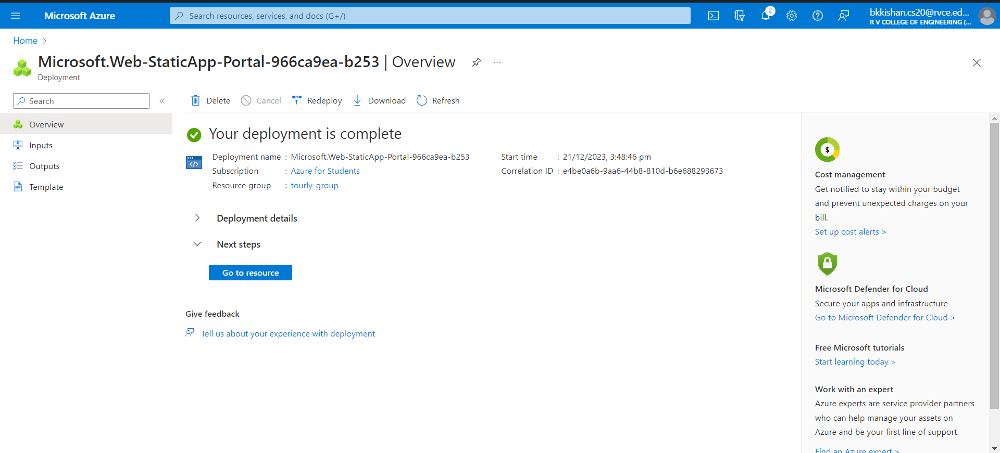
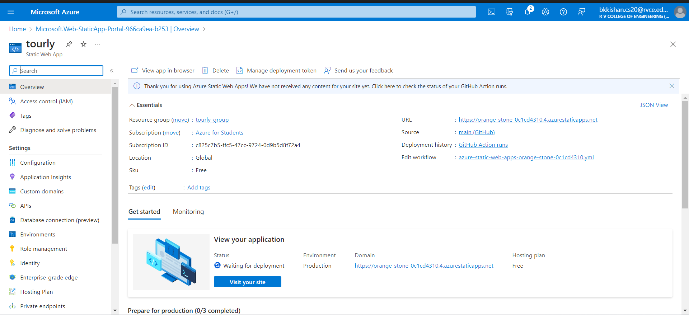

 
   
   
  
  

  <h2 align="center">Tourly - Travel website</h2>

  Welcome to TOURLY – Your Window to the World!

Embark on a journey to discover the breathtaking beauty of our planet as you explore our carefully curated collection of stunning images and captivating stories. Our static webpage is meticulously designed to showcase the alluring charm of diverse destinations, providing you with a captivating sneak peek into the wonders that await your exploration.

## Features

1. <h4>Static Content Display:</h4>
The webpage primarily displays static content, offering a set of curated images and engaging stories to captivate visitors.

2. <h4>Navigation Menu:</h4>
Users can navigate through different sections of the webpage using a navigation menu, allowing easy access to various parts of the content.

3. <h4>Multilingual Support:</h4>
The webpage incorporates a language translation feature, enabling users to select and view the content in different languages. This enhances accessibility for a diverse audience.

4. <h4>Responsive Design:</h4>
The webpage is designed to be responsive, ensuring an optimal viewing experience across various devices, such as desktops, tablets, and smartphones.

5. <h4>Dynamic Elements (JavaScript):</h4>
Although static, JavaScript may be used for dynamic elements such as image sliders, lightboxes, or other subtle interactive features to enhance user engagement.

# Technologies Used

The website is constructed utilizing the following technologies:

1. <h4>HTML:</h4>
HTML (HyperText Markup Language) is used for structuring and presenting content on the web. It defines the basic structure of a webpage.

2. <h4>CSS:</h4>
CSS (Cascading Style Sheets) is employed to style the HTML elements, enhancing the visual presentation of the website. It governs the layout, colors, and overall aesthetic.

3. <h4>JavaScript:</h4>
JavaScript is utilized to add interactivity and dynamic behavior to the website. It enhances the user experience by introducing features such as image sliders, language translation, or other interactive elements.

  <a href="https://kishan-spec.github.io/future-tour1/"><strong>➥ Live Demo</strong></a>

 

## Demo Screeshots

This serves as our main page, offering users the ability to navigate seamlessly to any section of the website.

 

 

Towards the bottom of the page, you'll find a language selection feature that allows you to translate our webpage into your preferred language. Explore the content in a language that suits you best and enhances your browsing experience.
 

 

 
here is the kannada version of the web page

 
here is the jananese version of the web page

 

## Deployment
Used Azure App Service, Azure Static Web App to deploy the website developed using Microsoft Azure. This image shows the app is deployed and running. The link for the website is given in the image.
 
 

 
here are the website deployment details
 

## Microsoft Visual Studio Code
Used Microsoft Visual Studio Code to develop the application website using HTML, CSS and JavaScript.

 

 

 

[Visit our website](https://kishan-spec.github.io/future-tour1/)

